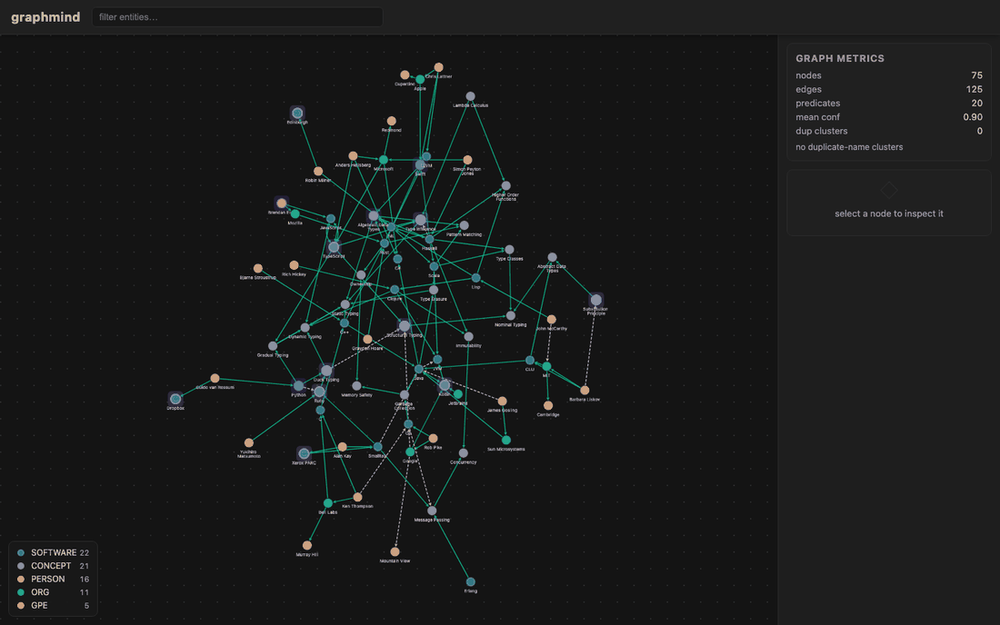
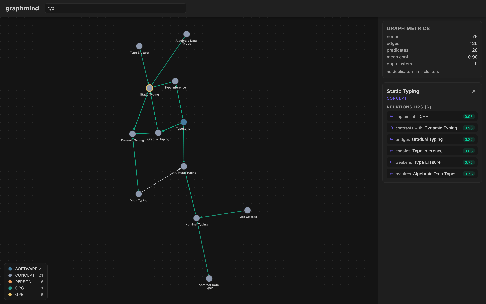

<div align="center">


[](pyproject.toml)
[](api/package.json)
[](load/)
[](extract/)
[](api/package.json)
[](viz/package.json)
[](viz/src/components/GraphViewer.jsx)
[](docker/)
[](LICENSE.md)

Graphmind is a knowledge-graph pipeline that turns a directory of plain text
into a queryable Neo4j property graph, extracting subject–predicate–object triples
with an LLM, collapsing duplicate entities by embedding similarity, and carrying
provenance and a confidence score on every edge.



</div>

> **Headline metric:** incremental CDC ingestion with upsert-only writes cut
> graph rebuild time from ~40 minutes (full pipeline re-run) to under 3 minutes
> on the reference corpus.

## How you use it

1. **Bring the stack up** — `docker compose -f docker/docker-compose.yml up --build`.
2. **Run the pipeline over your documents** — three steps, each resumable:
   ```bash
   python -m extract.triple_extractor --corpus /data/docs --out /out/triples.jsonl
   python -m resolution.entity_resolver --graph /out/triples.jsonl --out /out/resolved.jsonl
   python -m load.neo4j_loader --input /out/resolved.jsonl
   ```
3. **Explore what it built** — open the viewer on `:5173`, click an entity to open its
   neighbourhood, or filter by name. Every edge carries a confidence score, and edges
   the model inferred are drawn dashed so they are never mistaken for extracted fact.
4. **Query it as a graph.** It is an ordinary Neo4j property graph, so your own Cypher
   works; the [BFF](#api-bff) serves the same data as JSON if you are building on top.

After the first load, [CDC polling](#incremental-updates-cdc) keeps the graph current
as documents change, without rebuilding it.

## Features

- **Sentence-aware text chunking** with configurable size and trailing-context
  overlap (`extract/chunker.py`).
- **LLM-based SPO triple extraction** with batched calls, retries, confidence
  scoring, optional source-span citation enforcement, and pluggable LLM clients
  behind a single-method protocol (`extract/triple_extractor.py`,
  `extract/llm_client.py`).
- **Decoupled prompt configuration**: domain-specific templates, few-shot
  examples, and TOML-loaded `PromptConfig` separate from extraction logic
  (`extract/prompts/`).
- **Pydantic triple schema** with validation, dedup, confidence statistics, and
  ontology enforcement rules (`extract/schema.py`, `extract/ontology.py`).
- **Relationship inference** that bridges disconnected subgraphs with scored,
  capped, clearly-marked inferred edges
  (`extract/relationship_inference.py`).
- **Embedding-based entity resolution** with cosine-similarity union-find
  clustering, an alias table, and a human-in-the-loop merge review queue for
  borderline merges (`resolution/`).
- **Batched, upsert-only Neo4j loading** with UNWIND writes, retry backoff,
  uniqueness constraints, and idempotent re-runs (`load/`).
- **CDC polling** for incremental ingestion: new/changed/deleted documents are
  detected by content hash and applied as upserts (`load/cdc_poller.py`).
- **Express.js BFF** serving graph JSON, dedup metrics, hub rankings, node
  neighborhoods, and GraphML export (`api/`).
- **React + Cytoscape.js viewer** with force-directed canvas, substring and
  regex search, entity-type legend, node detail panel, and a live dedup metrics
  dashboard (`viz/`).
- **Full-stack Docker**: one command boots pipeline, API, viewer, and Neo4j
  together. No local Python/Node/Neo4j install needed.

## Quickstart (one command, fully dockerized)

```bash
git clone https://github.com/abj360/graphmind.git
cd graphmind
cp .env.example .env
docker compose -f docker/docker-compose.yml up --build
```

Then open:

- **Viewer** — <http://localhost:5173>
- **API (BFF)** — <http://localhost:4000> (`/health` should return `{"status":"ok"}`)
- **Neo4j browser** — <http://localhost:7474> (credentials from `.env`)

The `pipeline` container runs the CDC poller by default. Drop `.txt` files into
the `corpus_data` volume's source directory and they are ingested within one
poll interval, or run the pipeline stages manually (below).

## Pipeline

Each stage reads the previous stage's JSONL output, so stages can be re-run
independently. All stages run inside the `pipeline` container:

```bash
# 1. Extract triples from a corpus directory
docker compose -f docker/docker-compose.yml exec pipeline \
  python -m extract.triple_extractor --corpus /data/docs --out /out/triples.jsonl

# 2. Resolve duplicate entities (auto-merge above threshold, queue the rest)
docker compose -f docker/docker-compose.yml exec pipeline \
  python -m resolution.entity_resolver --graph /out/triples.jsonl \
    --out /out/resolved.jsonl --threshold 0.85

# 3. Load resolved triples into Neo4j (batched, idempotent upserts)
docker compose -f docker/docker-compose.yml exec pipeline \
  python -m load.neo4j_loader --input /out/resolved.jsonl
```

Extraction behavior is tuned through environment variables (see
[Configuration](#configuration)) and through `extract/prompts/default.toml`.

## Incremental updates (CDC)

`load/cdc_poller.py` watches the corpus directory and emits upsert/delete events
for changed files (detected by SHA-256 content hash), persisting its state in
`out/cdc_state.json` so restarts are cheap. This is what makes the graph
incremental: instead of re-running the whole pipeline, only changed documents
are re-extracted and upserted.

```bash
# Poll once (useful for smoke tests)
docker compose -f docker/docker-compose.yml exec pipeline \
  python -m load.cdc_poller --corpus /data/docs --once
```

## Viewer

Already running as part of the compose stack — open <http://localhost:5173>.
Highlights:

- Force-directed canvas with type-colored nodes and confidence-colored edges;
  inferred (bridging) edges render dashed.
- Substring search plus a `.*` regex toggle with fail-safe invalid-pattern
  handling.
- Entity-type legend with counts, node detail panel with incident relationships
  and confidence badges, and a self-refreshing dedup metrics dashboard.

Selecting an entity opens its neighborhood, with the direction and confidence of
every incident relationship:

<p align="center">
  
</p>

To explore without standing up Neo4j, serve the API from a seeded in-memory graph:

```bash
node api/scripts/demo_server.js     # BFF on :4000 with demo data
npm --prefix viz run dev            # viewer on :5173
```

See [docs/viewer-guide.md](docs/viewer-guide.md) for the full tour.

## API (BFF)

The Express service on `:4000` proxies Neo4j and shapes responses for the
viewer. All endpoints are read-only.

| Endpoint | Description |
| --- | --- |
| `GET /health` | Liveness probe used by compose healthchecks. |
| `GET /api/graph?limit=N` | View graph `{nodes, edges}` (limit 1–5000, default 500). |
| `GET /api/graph/labels` | Entity types with node counts. |
| `GET /api/graph/node/:name` | One entity's neighborhood (404 for unknown names). |
| `GET /api/metrics/dedup` | Node/edge totals, predicate spread, mean confidence, duplicate clusters. |
| `GET /api/metrics/hubs` | Top entities by relationship count. |
| `GET /api/export/graphml` | Full graph as GraphML download (XML-escaped labels). |

## Configuration

All configuration comes from environment variables; copy `.env.example` to
`.env` and adjust. Nothing secret is ever committed.

| Variable | Default | Purpose |
| --- | --- | --- |
| `NEO4J_URI` | `bolt://neo4j:7687` | Neo4j bolt endpoint. |
| `NEO4J_USER` / `NEO4J_PASSWORD` | `neo4j` / `graphmind-dev` | Neo4j credentials. |
| `OPENAI_API_KEY` | — | LLM provider key for extraction. |
| `GRAPHMIND_EXTRACT_MODEL` | `gpt-4o-mini` | Extraction model. |
| `GRAPHMIND_EXTRACT_BATCH_SIZE` | `8` | Chunks per batched extraction call. |
| `GRAPHMIND_EXTRACT_MIN_CONFIDENCE` | `0.0` | Drop triples below this confidence. |
| `GRAPHMIND_EXTRACT_REQUIRE_SPAN` | `false` | Require source-span citations per triple. |
| `GRAPHMIND_CHUNK_MAX_CHARS` | `1200` | Chunk size ceiling. |
| `GRAPHMIND_CHUNK_OVERLAP_CHARS` | `120` | Trailing-context overlap per chunk. |
| `GRAPHMIND_CHUNK_MIN_CHARS` | `200` | Minimum chunk length before merging. |
| `GRAPHMIND_EMBEDDING_PROVIDER` | `ngram` | `ngram` (offline) or `openai` embeddings. |
| `GRAPHMIND_RESOLVE_THRESHOLD` | `0.85` | Auto-merge cosine threshold. |
| `GRAPHMIND_RESOLVE_REVIEW_FLOOR` | `0.70` | Borderline-merge review floor. |
| `GRAPHMIND_LOAD_BATCH_SIZE` | `500` | Rows per UNWIND batch. |
| `GRAPHMIND_CORPUS_DIR` | `/data/docs` | Watched corpus directory. |
| `GRAPHMIND_CDC_INTERVAL_SECONDS` | `5` | CDC poll interval. |
| `API_PORT` / `VIZ_PORT` | `4000` / `5173` | Service ports. |
| `GRAPHMIND_BACKUP_DIR` / `_RETENTION_DAYS` | `/backups` / `14` | Backup location and retention. |

## Project structure

```
extract/        chunking, LLM extraction, prompts, schema, ontology, inference
resolution/     embedding-based entity resolver, alias table, review queue
load/           batched Neo4j loader, CDC poller
api/            Express.js BFF (routes, GraphML serializer, contract tests)
viz/            React + Cytoscape.js viewer (Vite)
tests/          unit/ (offline, fake-based) and integration/ (driver doubles, live Neo4j opt-in)
docker/         per-service Dockerfiles, docker-compose.yml, backup/restore scripts
docs/           architecture, ADR-001, ops notes, tuning + viewer guides,
                retrieval-core integration
.github/        CI workflow, CODEOWNERS, dependabot, PR template
```

## Development

### Python (pipeline)

Requires Python 3.12+.

```bash
python -m venv .venv && source .venv/bin/activate
pip install -e ".[dev]"

ruff check . && ruff format --check .   # lint + format (line length 100)
mypy extract resolution load            # strict type checking
pytest tests/unit -q                    # fast, fully offline (fake LLM, doubles)
pytest tests/integration -q             # recording driver doubles; live tests skip
pytest tests/integration -q \
  --env GRAPHMIND_TEST_NEO4J_URI=bolt://localhost:7687  # opt-in live Neo4j run
```

### API (Express BFF)

Requires Node.js 20+.

```bash
cd api
npm ci
npm test          # node --test contract + serializer + roundtrip suites
npx eslint .      # lint
npx prettier --check .
```

### Viewer (React)

```bash
cd viz
npm ci
npm run dev       # Vite dev server with /api proxy to :4000
npm run build     # production bundle (what viz.Dockerfile ships)
npx eslint .
```

### Pre-commit hooks

```bash
pip install pre-commit
pre-commit install
pre-commit run --all-files
```

Hooks run Ruff (lint + format), trailing-whitespace/end-of-file checks, YAML
validation, and Prettier for JS/JSON/YAML/Markdown/CSS — the same gates CI
enforces.

## Testing philosophy

- Tests live next to what they test (`tests/unit`, `tests/integration` mirror
  the source tree).
- A test asserts on real behavior, not on a mock that always succeeds: the fake
  LLM client and recording Neo4j driver are scripted doubles that can fail.
- New logic ships with tests in the same PR, not a follow-up ticket.
- Integration tests that need a live Neo4j skip cleanly unless
  `GRAPHMIND_TEST_NEO4J_URI` is set.

## CI

`.github/workflows/ci.yml` runs on every push and PR: Ruff lint + format, mypy
`--strict`, unit tests, integration tests against a Neo4j service container,
ESLint + Prettier on the API, the API contract tests, a production build of the
viewer, a full `docker compose build`, `pip-audit` dependency scanning, and
ShellCheck on the ops scripts. Nothing merges red.

## Backups

```bash
# Dump Neo4j to a timestamped, verified, retention-pruned archive
docker compose -f docker/docker-compose.yml run --rm backup

# Verify every archive in the backup dir
docker/verify_backup.sh

# Restore (destructive; requires explicit confirmation)
GRAPHMIND_RESTORE_CONFIRM=yes docker/restore.sh latest
```

See [docs/ops-neo4j.md](docs/ops-neo4j.md) for the full operations runbook.

## Documentation

- [docs/architecture.md](docs/architecture.md) — orientation and invariants
- [docs/adr/ADR-001-extraction-and-schema-design.md](docs/adr/ADR-001-extraction-and-schema-design.md)
  — the load-bearing design decisions
- [docs/extraction-tuning.md](docs/extraction-tuning.md)
  — batching, confidence floors, citation enforcement, cost
- [docs/viewer-guide.md](docs/viewer-guide.md) — the viewer, end to end
- [docs/ops-neo4j.md](docs/ops-neo4j.md) — backups, restores, monitoring, upgrades
- [docs/integration-retrieval-core.md](docs/integration-retrieval-core.md)
  — querying this graph as a secondary retrieval path from `retrieval-core`

## Contributing

See [CONTRIBUTING.md](CONTRIBUTING.md).

---

<div align="center">
Maintained by <a href="https://github.com/abj360">abj360</a> · MIT licensed
</div>
